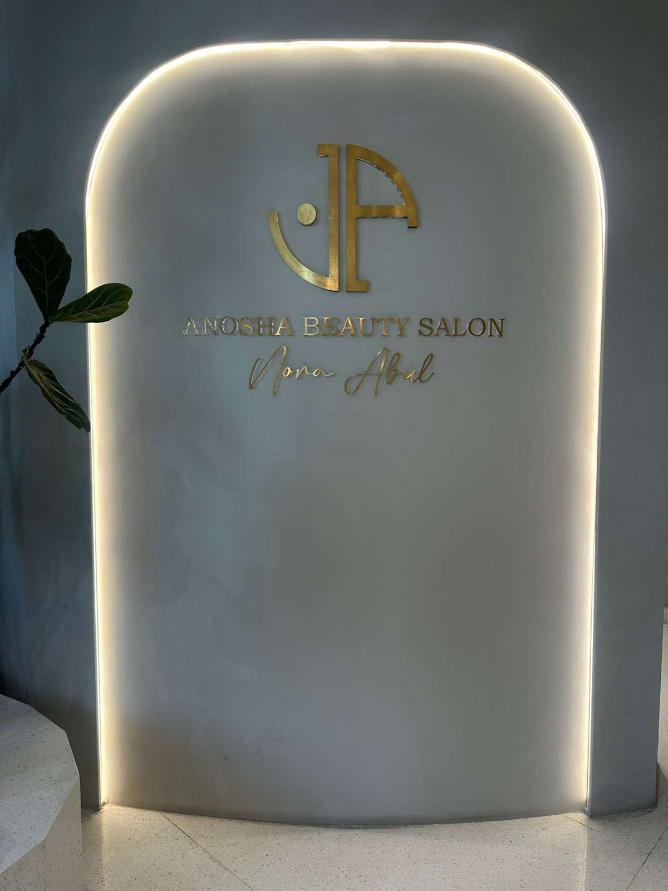
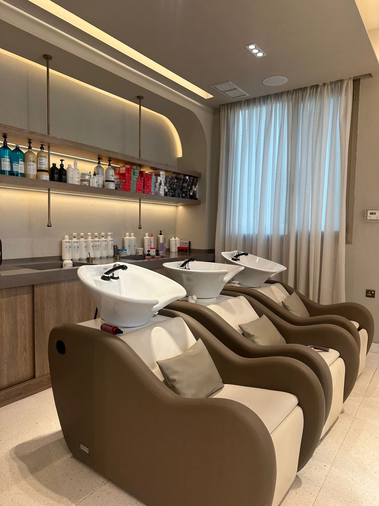
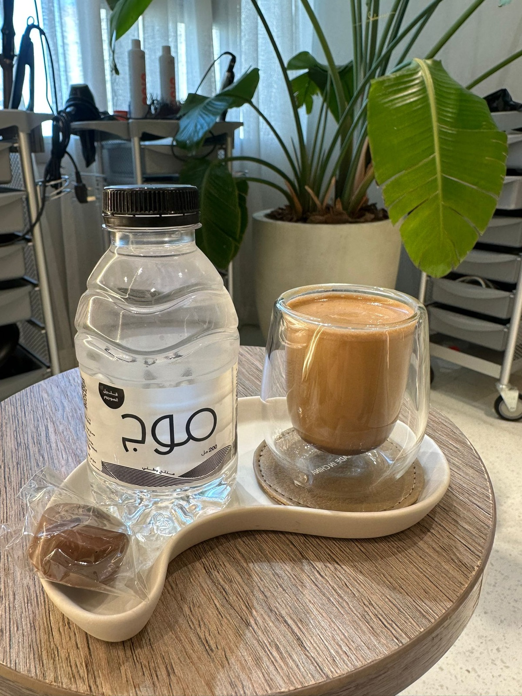
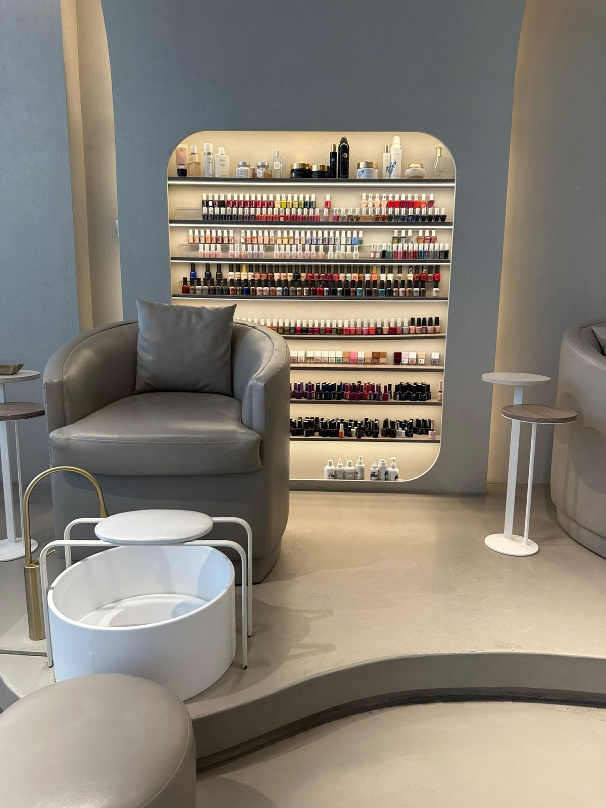

<!--
⚠ AR PUBLISHING IS GATED. Author EN, STAGE AR. Do NOT publish until:
   1) WPML is live on production (S2-19), AND
   2) a human reviews/edits this translation (project bilingual rule —
      AR is never machine-translated-and-shipped).
Reuse the EN JSON-LD (BeautySalon + Breadcrumb + FAQPage) at build,
swapping url/description/inLanguage to the AR equivalents.
-->

# صالون أنوشة، صباح السالم: واحة هادئة بالحجز

> **اختيار المحرّر لهذا الأسبوع** — نظرة مباشرة على صالون في صباح السالم يتقن التفاصيل الصغيرة.

<figure>
  <picture>
    <source srcset="../assets/anosha-beauty-salon/anosha-beauty-salon-sabah-al-salem-signage.webp" type="image/webp">
    
  </picture>
  <figcaption>مدخل صالون أنوشة — نورة أبل، في صباح السالم.</figcaption>
</figure>

بعض الصالونات تبيعك الضجيج؛ وأنوشة تبيعك العكس وتُتقنه. في الطابق الثالث في **صباح السالم**، يعمل هذا الصالون **للنساء فقط** و**بالحجز** بالكامل، وهذا القرار البسيط يصوغ كل شيء: لا انتظار، لا ازدحام، لا استعجال. تحجزين موعدكِ، تصلين، فيكون المكان لكِ.

ببساطة: هادئ، ونظيف.

## ما الذي لفت الانتباه

أول ما تلاحظينه هو غياب الازدحام؛ فلأن كل زيارة بموعد، لا ينزلق المكان إلى الصخب الذي اعتدنا تحمّله في أماكن أخرى. الموسيقى تبقى هادئة — من النوع الذي يساعد فعلاً على الاسترخاء.

المكان نفسه راقٍ؛ التفاصيل مدروسة لا مجرّد نظيفة: خشب دافئ، إضاءة ناعمة، وجدار من ألوان طلاء الأظافر، وكراسي غسيل شعر مريحة.

<figure>
  <picture>
    <source srcset="../assets/anosha-beauty-salon/anosha-beauty-salon-hair-wash-lounge.webp" type="image/webp">
    
  </picture>
  <figcaption>ركن غسيل الشعر — كراسي مريحة ورفّ منتجات احترافية كامل.</figcaption>
</figure>

لكن ما بقي في الذاكرة هو **الاهتمام** — سؤالٌ عن راحتكِ وعمّا تحتاجينه، وضيافة دافئة لا تجدينها دائمًا. يُقدَّم لكِ القهوة والماء عند جلوسكِ، فيضبط ذلك إيقاع الزيارة كلها.

<figure>
  <picture>
    <source srcset="../assets/anosha-beauty-salon/anosha-beauty-salon-welcome-coffee.webp" type="image/webp">
    
  </picture>
  <figcaption>قهوة وماء ترحيب عند الوصول.</figcaption>
</figure>

> «صراحة شيء رائع — مرتّب ونظيف جدًا.» — من زيارتنا

## تفصيلة تستحق الذكر

لا توجد غرفة صلاة مخصّصة، لكن عند الطلب بادر الطاقم بترتيب مكان خاص ومستور، ووفّروا ثوب صلاة وسجّادة وأشاروا إلى اتجاه القبلة — ضيافة عند الطلب تكشف كيف يُعامَل الضيف، دون تكلّف.

## ماذا يقدّم أنوشة

رغم هدوئه، قائمة الخدمات غنية — شعر وأظافر ورموش وحواجب ومساج وأطفال وباقات عرائس. أسعار تقريبية للتوضيح (بالدينار الكويتي، **استرشادية وقابلة للتغيير — تأكّدي عند الحجز**):

**الشعر**

| الخدمة | تبدأ من |
|---|---|
| غسيل / تخفيف / قص | 3 / 7 / 12 د.ك |
| سشوار عادي | 6 د.ك |
| سشوار روسي | 15 د.ك |
| ويفي / تجعيد | 10 د.ك |
| صبغة شعر | 35 د.ك |
| صبغة مع هايلايت | 80 د.ك |
| علاجات (أولابلكس، جولدويل، كافيار، جويكو) | 15 د.ك |
| إكستنشن شعر (برونزي / فضي / ذهبي) | 50–80 د.ك |

**الأظافر**

| الخدمة | تبدأ من |
|---|---|
| مانيكير / بديكير | 6 د.ك |
| مانيكير + بديكير روسي | 14 د.ك |
| جل بوليش | 10 د.ك |
| سبا فاخر مانيكير + بديكير (ريتوالز، شانيل، ديور) | 20–22 د.ك |
| تركيب أظافر (بوليجل، بيلدر، Gel-X) | 25 د.ك |

**رموش وحواجب وأكثر**

| الخدمة | تبدأ من |
|---|---|
| إكستنشن رموش / رفع رموش | 35 / 25 د.ك |
| حواجب تركي | 25 د.ك |
| إزالة شعر حواجب وشفة عليا | 3 د.ك |
| مساج (رأس، أكتاف، يد، قدم — 15 دقيقة) | 4 د.ك |
| قائمة الأطفال (سشوار، تسريحة، مكياج) | 5 د.ك |

**المناسبات والعرائس**

| الخدمة | تبدأ من |
|---|---|
| باقة الغرفة الخاصة (عيد ميلاد، تخرّج، توديع عزوبية) | 80 د.ك |
| تسريحة عروس | 150 د.ك |
| باقة العروس VIP (مانيكير-بديكير، ماسك، علاج، مكياج، تسريحة، ورد، غرفة خاصة) | 650 د.ك |

<figure>
  <picture>
    <source srcset="../assets/anosha-beauty-salon/anosha-beauty-salon-nail-bar.webp" type="image/webp">
    
  </picture>
  <figcaption>ركن الأظافر — جدار كامل من الألوان مع أركان مانيكير وبديكير.</figcaption>
</figure>

> قائمة الأسعار المطبوعة كاملة متوفرة في الصالون ومحفوظة في صفحة Q8tly — الصور في `assets/anosha-beauty-salon/price-list/`.

## لمن يناسب

أنوشة لمن لا تحب الانتظار — تدخلين في موعدكِ، تنجزين ما جئتِ من أجله، وتمضين — ولمن تقدّر الهدوء والفايب المريح بدل صخب الصالونات المزدحمة. خيار سهل لموعد يومي مريح، ويتّسع للتخرّج وتوديع العزوبية ويوم العرس كاملًا حين تريدين كل شيء في مكان واحد هادئ.

## قبل أن تذهبي

| | |
|---|---|
| **المنطقة** | صباح السالم (مبارك الكبير) — الطابق الثالث |
| **الدوام** | يوميًا 10:00 صباحًا – 8:00 مساءً (يشمل الجمعة) |
| **الحجز** | بالموعد — يُفضّل الاتصال مسبقًا |
| **الهاتف** | [‎+965 6566 5028](tel:+96565665028) |
| **إنستغرام** | [@anosha_salon](https://www.instagram.com/anosha_salon/) |
| **الأسعار** | `$$` |
| **الدفع** | كي نت · فيزا / ماستركارد |
| **معلومات مفيدة** | للنساء فقط · تكييف قوي · موقف سيارات سهل خلف المبنى |

**التفاصيل الكاملة والموقع ←** [صالون أنوشة على Q8tly](/ar/place/anosha-beauty-salon)

## أسئلة شائعة

**وين يقع صالون أنوشة؟**
في صباح السالم (محافظة مبارك الكبير)، الطابق الثالث، مع موقف سيارات سهل خلف المبنى.

**هل أحتاج موعد؟**
نعم — أنوشة بالحجز، وهذا ما يبقيه هادئًا وغير مزدحم. اتصلي على ‎+965 6566 5028 أو راسلي [@anosha_salon](https://www.instagram.com/anosha_salon/).

**هل الصالون للنساء فقط؟**
نعم، صالون للنساء فقط.

**ما أوقات الدوام؟**
يوميًا من 10:00 صباحًا حتى 8:00 مساءً، ويشمل الجمعة.

**كم سعر المانيكير أو السشوار؟**
المانيكير يبدأ من حوالي 6 د.ك، والسشوار العادي من حوالي 6 د.ك. الأسعار استرشادية وقد تتغيّر.

**هل يقدّم أنوشة خدمات العرائس؟**
نعم — من تسريحة العروس إلى باقة العروس VIP الكاملة، إضافة إلى باقات الغرفة الخاصة لأعياد الميلاد والتخرّج وتوديع العزوبية.

**ما طرق الدفع؟**
كي نت وفيزا / ماستركارد.

---

### اكتشفي المزيد في صباح السالم

- **المنطقة:** [أماكن وفعاليات في صباح السالم ←](/ar/sabah-al-salem)
- **التصنيف:** [صالونات التجميل في الكويت ←](/ar/category/beauty)

---

**ملاحظة تحريرية:** يستند هذا المقال إلى زيارة ميدانية مباشرة من Q8tly (أساس شارة «موثّق»). الدوام والأسعار والدفع والمزايا تعكس ما تأكّد وقت الزيارة، والأسعار استرشادية وقد تتغيّر — يُرجى الاتصال للتأكيد. لا نقبل مقابلًا ماديًا للتغطية التحريرية.
